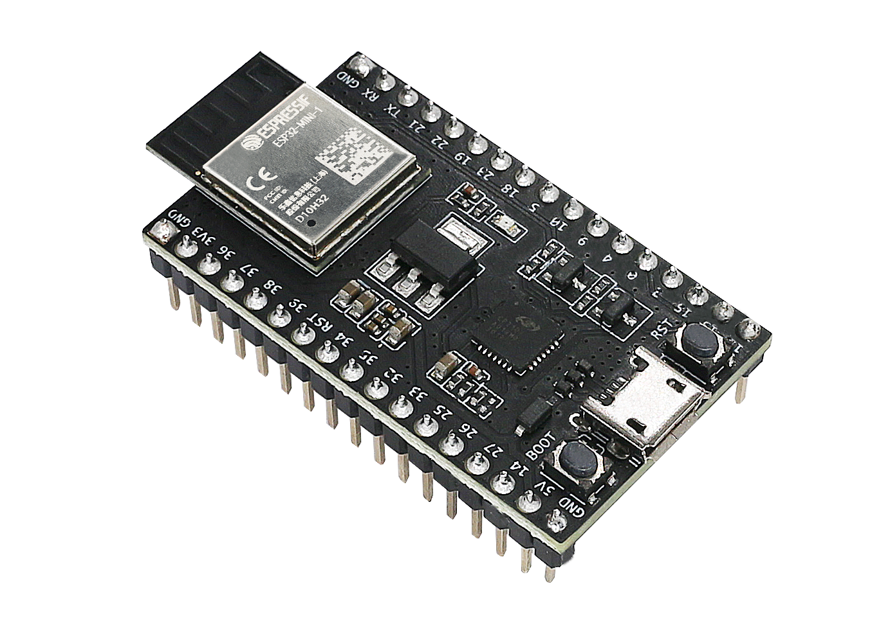

## Practicas ESP

En este repositorio, el docente Luzko podra encontrar los ejercicios de Belmonte que estan
orientados a la practica de uso del microcontrolador tipo ESP32.

RESUMEN EJERCICIOS Y CLASES:
 - Ejercicio 1: 23/04 | "Hola mundo estoy en core X"
 - Ejercicio 2: 23/04 | Programacion de un solo semaforo
 - Ejercicio 3: 24/04 | Sincronizacion entre 2 semaforos y 2 cores
 - Ejercicio 4: 07/04 | Generar IDs random de una lista y imprimir respectivamente
 - Ejercicio 5: 09/04 | RGB, 3 LEDs, prenderde manera random priorizando el BLINK
